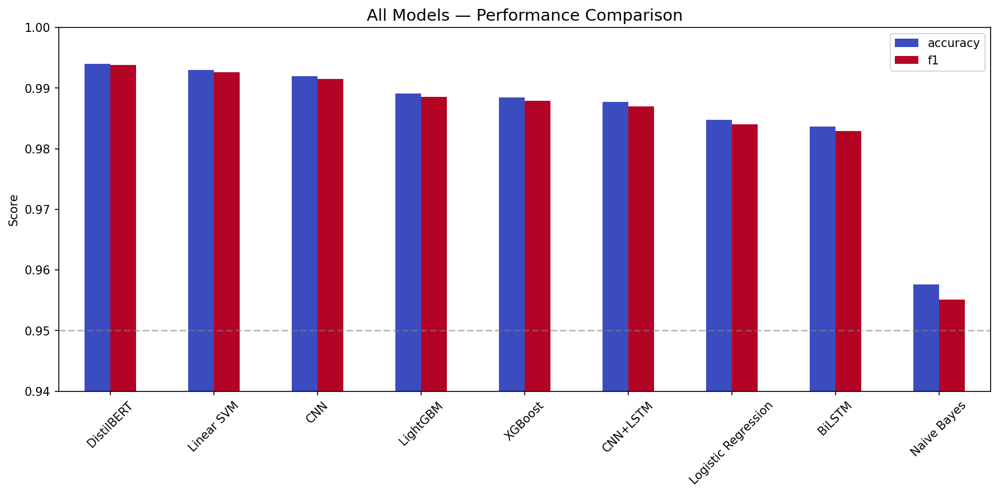
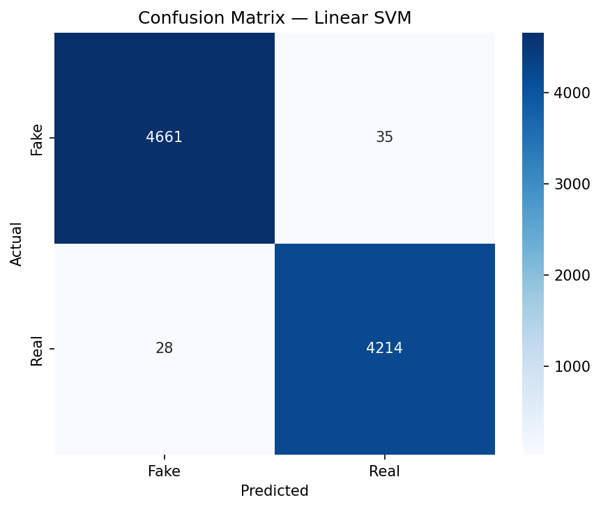
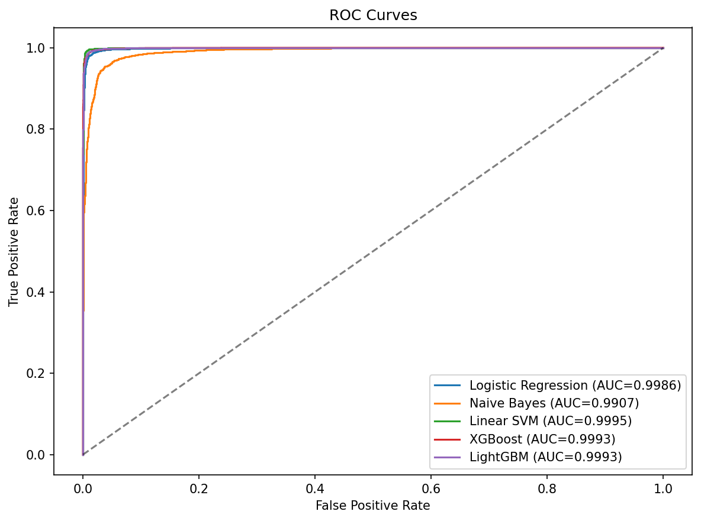
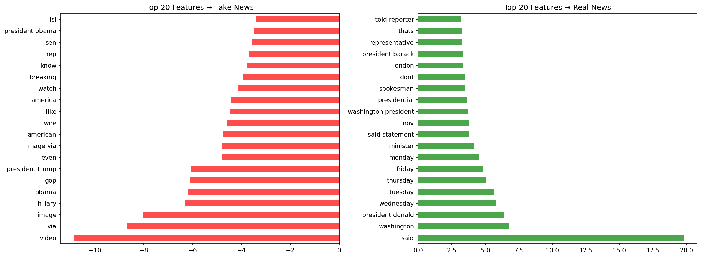
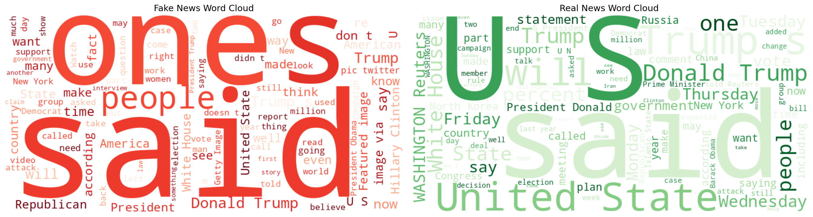
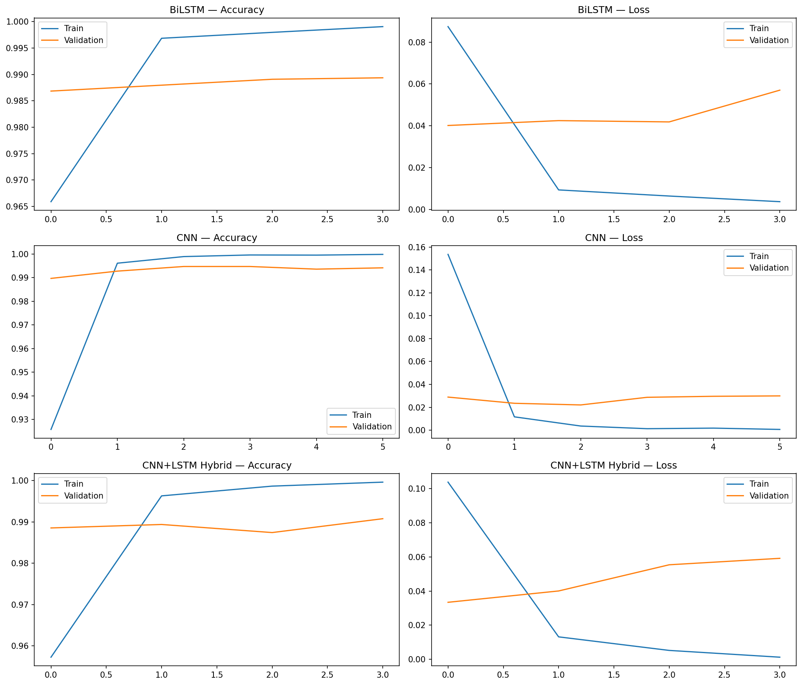

# 🗞️ Fake News Detection: From EDA to Deep Learning

A Kaggle practice project comparing **9 models** across **Traditional ML**, **Deep Learning**, and **Transformer-based** approaches for binary fake news classification.

> 📓 **Kaggle Notebook:** [View on Kaggle](https://www.kaggle.com/code/johnson00111/ai-termproject-tj/notebook)


## 📊 Results at a Glance

| Rank | Model | Accuracy | F1 Score | Training Time |
|------|-------|----------|----------|---------------|
| 1 | **DistilBERT** | **99.30%** | **0.9929** | ~15 min (GPU) |
| 2 | Linear SVM | 99.30% | 0.9926 | ~30 sec (CPU) |
| 3 | CNN | 99.27% | 0.9923 | ~30 sec (GPU) |
| 4 | LightGBM | 98.91% | 0.9886 | ~1 min (CPU) |
| 5 | XGBoost | 98.85% | 0.9879 | ~1 min (CPU) |
| 6 | BiLSTM | 98.70% | 0.9863 | ~3 min (GPU) |
| 7 | CNN+LSTM | 98.57% | 0.9850 | ~2 min (GPU) |
| 8 | Logistic Regression | 98.48% | 0.9840 | ~30 sec (CPU) |
| 9 | Naive Bayes | 95.76% | 0.9551 | ~2 sec (CPU) |

> **Key Finding:** Linear SVM + TF-IDF achieves nearly identical performance to DistilBERT while training 30x faster — a strong argument for traditional ML in production settings.

## 🔍 Project Highlights

- **Thorough EDA** — Uncovered data leakage risks (non-overlapping subjects, Reuters markers), quantified writing style differences (12x more exclamation marks in fake news)
- **Deliberate preprocessing** — Removed Reuters tags to prevent data leakage; combined title + text for richer features
- **9-model comparison** — Spanning Naive Bayes → SVM → Gradient Boosting → LSTM → CNN → Transformer
- **Deep analysis** — Explained why CNN outperforms LSTM on this task (local n-gram patterns > long-range dependencies), backed by feature importance analysis
- **Error analysis** — Examined 63 misclassified articles to understand model blind spots

## 📁 Project Structure

```
fake-news-detection/
├── README.md
├── requirements.txt
├── fake_news_detection.ipynb         # Full notebook (EDA → ML → DL)
└── results/
    ├── model_comparison.png
    ├── confusion_matrix.png
    ├── roc_curves.png
    ├── feature_importance.png
    └── training_curves.png
```

## 🛠️ Tech Stack

| Category | Tools |
|----------|-------|
| **Language** | Python 3.10 |
| **NLP** | NLTK, TF-IDF, Keras Tokenizer, HuggingFace Transformers |
| **Traditional ML** | scikit-learn, XGBoost, LightGBM |
| **Deep Learning** | TensorFlow/Keras (LSTM, CNN), PyTorch (DistilBERT) |
| **Visualization** | Matplotlib, Seaborn, WordCloud |
| **Environment** | Kaggle Notebook (GPU T4 ×2) |

## 🚀 Quick Start

```bash
# Clone the repo
git clone https://github.com/johnson00111/fake-news-detection.git
cd fake-news-detection

# Install dependencies
pip install -r requirements.txt

# Download dataset from Kaggle
# https://www.kaggle.com/datasets/clmentbisaillon/fake-and-real-news-dataset
# Place Fake.csv and True.csv in the project root

# Run the notebook
jupyter notebook fake_news_detection.ipynb
```

Or simply view the full notebook with outputs on [Kaggle](https://www.kaggle.com/code/johnson00111/ai-termproject-tj/notebook).

## 📈 Key Visualizations

### Model Performance Comparison


### Confusion Matrix (Linear SVM)


### ROC Curves


### Feature Importance


### Word Clouds


### Deep Learning Training Curves


## 💡 Key Insights

### Why CNN beats LSTM on this task
The discriminative features are **short, fixed phrases** (2–5 words) like `pic twitter com` or `told reporters`. CNN's size-5 filters are essentially doing 5-gram pattern matching — perfectly suited for this. LSTM's long-range dependency strength isn't needed because fake vs real news differs at the **phrase level**, not paragraph-level logic.

### Data Leakage Awareness
- Subject categories have **zero overlap** between fake and real → excluded from features
- Reuters markers removed in preprocessing to prevent source-based shortcuts
- These decisions reduced raw accuracy but improved model integrity

### Practical Takeaway
For production deployment, **Linear SVM + TF-IDF** is the recommended approach: 99.30% accuracy, trains in seconds, no GPU required, and easily interpretable via feature coefficients.

## ⚠️ Limitations

- Dataset covers **2016–2017 U.S. political news only** — generalization to other domains/periods is unverified
- DistilBERT was fine-tuned on a 5K subset due to compute constraints — full dataset may yield better results
- 73.4% of dates were unparseable, limiting temporal analysis
- Model may still learn source-specific patterns beyond Reuters tags

## 📚 Dataset

**ISOT Fake News Dataset** from Kaggle
- Source: [kaggle.com/datasets/clmentbisaillon/fake-and-real-news-dataset](https://www.kaggle.com/datasets/clmentbisaillon/fake-and-real-news-dataset)
- 23,481 fake + 21,417 real news articles
- Collected by University of Victoria, Canada

## 📄 About

This project was built as a Kaggle practice exercise to explore the full NLP pipeline — from EDA and text preprocessing through traditional ML to deep learning and transformers. The dataset is subject to its original license on Kaggle.
